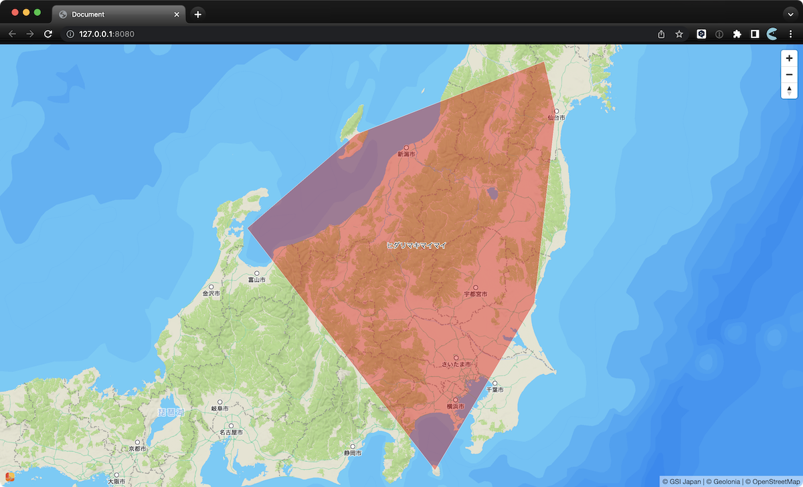
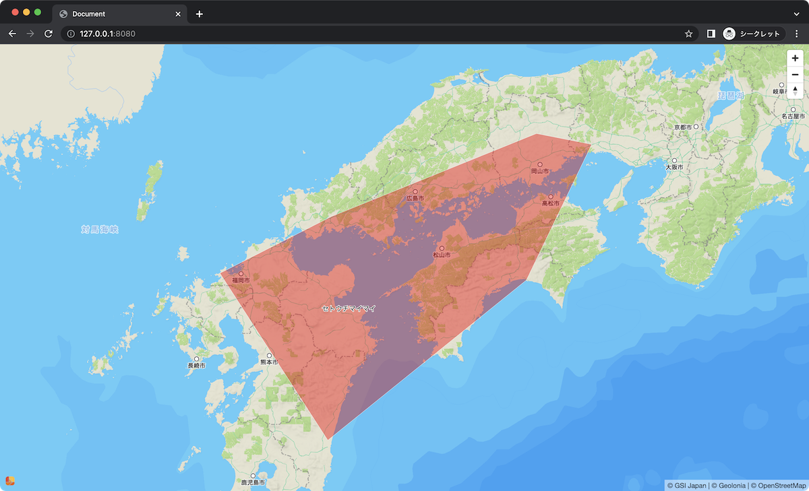

# @kamataryo/inat-convex

A CLI tool to generate GeoJSON polygons that enclose the convex hull of species distribution areas.

## Usage example

Place a common name in any language or scientific name with 1st argument.

```shell
# Get a GeoJSON in polygon with stdout
$ npx @kamataryo/inat-convex "セトウチマイマイ"          # with a Japanese common name
$ npx @kamataryo/inat-convex "Arctic Char"            # with an English common name
$ npx @kamataryo/inat-convex "Salvelinus leucomaenis" # with a scientific name

# Pipe to anything. Sample to preview with geolonia/view-geojson
$ npx @kamataryo/inat-convex "セトウチマイマイ" | npx @geolonia/view-geojson
```

### samples

|||
|---|---|
|<span class="italic" style="font-style:italic">Euhadra quaesita</span> (ヒダリマキマイマイ)|<span class="italic" style="font-style:italic">Euhadra subnimbosa</span> (セトウチマイマイ)|
|||
|`$ npx @kamataryo/inat-convex "ヒダリマキマイマイ" \| npx @geolonia/view-geojson` | `$ npx @kamataryo/inat-convex "セトウチマイマイ" \| npx @geolonia/view-geojson`|
|Arctic Char (ホッキョクイワナ)|Char (イワナ)|
|||
|`$ npx @kamataryo/inat-convex "Arctic Char" \| npx @geolonia/view-geojson`|`$ npx @kamataryo/inat-convex "salvelinus leucomaenis" \| npx @geolonia/view-geojson`|

## Acknowledgments

This npm wraps [iNaturalist API](https://www.inaturalist.org/pages/api+reference).
I would like to thanks to all iNaturalist users and the platform.
